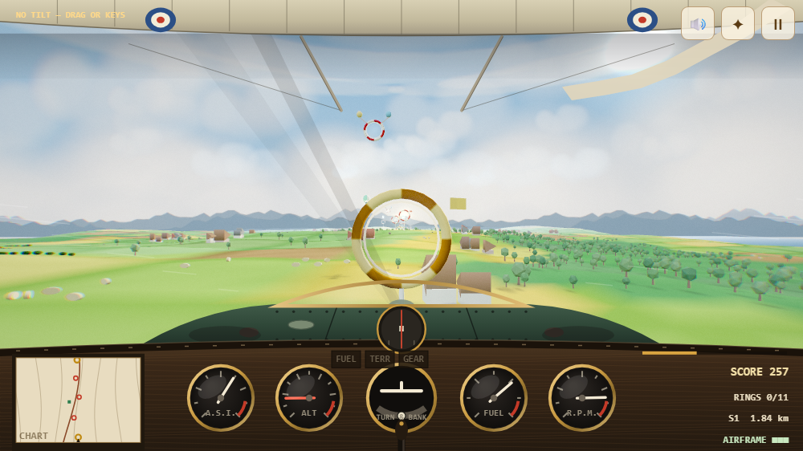

# Skylark Run

Open-cockpit air racing over sunlit countryside. Thread the gates, keep the chain
alive, then put the aeroplane down on the runway at the end of the sector.

The game is a single self-contained `index.html` — Three.js from a CDN, no build
step. The only server-side piece is one function for the world leaderboard, and
the game plays perfectly without it. Runs on desktop and installs to a phone home
screen as a PWA.



## Flying it

| Input | Action |
| --- | --- |
| Tilt (phone) | bank, dive, climb |
| Drag (touch) | same, when tilt is unavailable |
| WASD / arrows | same, on desktop |
| `Esc` / `P` | pause |

Landscape orientation is required on phones; the tilt datum is captured when you
tap **Enable tilt & fly**, and can be re-taken from the pause screen.

**Exit game** on the pause screen shuts the flight down properly — engine off,
out of fullscreen, orientation released, rendering stopped, logbook flushed —
then asks the browser to close the page. A page may only close itself when it
was opened by script or is running as an installed app, so on a normal browser
tab it says so and leaves you on a shutdown card rather than pretending.

## The run

- **Take off first.** Every sector starts at the holding point with the engine
  running. Full power, hold the centreline, and ease back at Vr (180 km/h) — she
  unsticks after about 400 m of roll and climbs away. Leave it too late and she
  flies herself off at the end of the strip; wander off the side and you bend her.
  **Fuel, score and sector distance only start once you are airborne.**
- **Gates** score 120 x your chain multiplier, up to x8. Dead-centre is a bullseye.
  Fly past one and the chain breaks.
- **Gold gates** pay treble, and are never on the easy line — down in the hollows,
  out on a limb, low enough over the trees to make you think about it. Roughly two
  or three a sector. The chart and the gate marker both flag them in gold.
- **Fuel balloons** put 38 back in the tank. Fuel is the clock — it never stops.
- **Hazards** from sector 2: pylon cables, guyed masts, wind turbines, balloons and
  bird flocks. Terrain and treetops are always live.
- **Hedge hopping** under 45 m AGL pays a trickle bonus. So does staying alive.
- **The runway** ends every sector. It is put down while still over the horizon,
  so it fades up out of the haze as you close on it; the approach call comes at
  1100 m. Line up on the centreline, ride the 5-degree slope, and touch down
  softly and straight:

  | Result | Requirement | Bonus |
  | --- | --- | --- |
  | Greased it | sink < 7 m/s, within 10 m of the centreline, wings level | +1500 |
  | Good landing | sink < 13 m/s, within 20 m | +900 |
  | Firm landing | sink < 19 m/s | +400 |
  | Heavy | anything worse | bounce, airframe damage, go around |

  Then hold the centreline through the rollout — about 210 m and nine seconds of
  it, drag first and brakes as she slows. Run off the side or off the end and the
  bonus is gone.

Each sector changes the land (meadows, highlands, lakeland, downland), the light
(morning through golden hour) and, from sector 3, the weather (gusts, showers,
thermals).

## Logbooks

Two of them, and the game never waits on either.

**Yours** — top five scores, best score, furthest sector and longest chain — is
kept in `localStorage` and shown on the title card. Every access is guarded, so
private browsing or a full quota just means it stays in memory for the session.

**The world board** lives in Upstash Redis behind `/api/scores`:

| | |
| --- | --- |
| `GET /api/scores` | the top ten pilots, best run each |
| `POST /api/scores` | submit `{ name, score, lvl, rings, chain }` |

The sorted set keys on the pilot's three initials with `ZADD GT`, so the board
shows ten distinct pilots rather than one good session ten times, and the run
detail sits in a parallel hash. Submissions are validated (initials, plausible
score for the sector reached, clamped rings and chain) and throttled per address.

**On cheating:** the client is a web page, so anyone can post whatever they like
to that endpoint. The bounds keep casual nonsense off the board and nothing more
— treat the world board as a friendly scoreboard, not an authority.

If the store is unprovisioned or unreachable the endpoint says so plainly, the
game shows your local logbook instead, and play is unaffected.

### Provisioning the store

```
vercel integration add upstash/upstash-kv     # then approve in the browser
vercel deploy --prod                          # pick up the injected env vars
```

The handler accepts either `KV_REST_API_URL`/`_TOKEN` (Marketplace) or
`UPSTASH_REDIS_REST_URL`/`_TOKEN` (a direct Upstash account).

## How it is put together

Systems are small managers with the same shape — build once, `reset(level)`,
`update(dt)` — and everything that scrolls is pooled and recycled.

- **Terrain** is one pure height function driving geometry, scatter placement and
  collision, so what you see is exactly what you hit. Tiles are recycled around
  the aircraft with analytic normals, which keeps the lighting seamless.
- **Scatter** (woodland, hedgerows, farmsteads, rocks) is a deterministic cell
  grid rebuilt in instanced meshes whenever the aircraft crosses a cell boundary.
- **Post** is a hand-rolled bloom + god-ray + grade chain on core Three.js only.
- **The cockpit** is drawn in 2D over the render: brass gauges, a magnetic
  compass, a paper chart on the knee, and a parasol wing overhead.
- **Contact shadows** without shadow maps: the sun is fixed for a sector, so
  scenery gets a soft instanced blob thrown away from it, and the aeroplane gets
  a silhouette on the ground. That one is cast forward at a fixed rake rather
  than honestly — the sun is ahead of you in every sector, so a true projection
  would hide your own shadow behind the tail forever.

Measured cost is about 0.7 ms of JavaScript per frame (0.07 ms simulation,
0.66 ms cockpit); the rest is GPU.

## Development

Screenshot any state headlessly with the shared shot tool:

```
node C:/Claude/Tools/shot/shot.mjs ./index.html --viewport 1280x720 --wait 4000 \
  --eval "window.SKY.play()" --out shots/play.png
```

`window.SKY` is the test hook: `takeoff()`, `play()` (takes off for you), `approach()`, `step(n, dt)` to advance
the simulation without waiting on frames, `hold(true)` to freeze the clock while
still rendering, and `fx(false)` to drop the post chain.

The smoke test drives all of that — the take-off roll, the ring course, a flown
approach, a go-around and a heavy arrival — and fails on any console error:

```
node tools/headless-test.mjs     # the game: flight, gates, approach, logbook
node tools/api-test.mjs          # the leaderboard endpoint, without a live store
```
